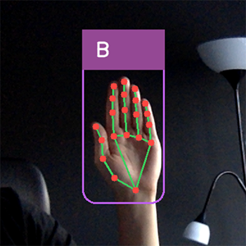
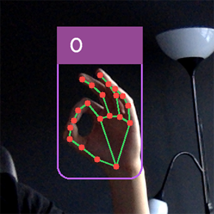

# SignIT - Hand Sign Language Translator

> App that detects and translates polish sign language in realtime

[](https://forthebadge.com) [](https://forthebadge.com)

This project was created for learning purposes. The goal of this application is to detect and translate polish sign language from webcam in real time.

The app detects hand in webcam view using mediapipe library, process hand landmarks coordinates to relative and normalized form and pass them to classifier which returns which hand sign it is. Using openCV library each frame from webcame is processed to display output information on the screen. Classifier ML model is created using Tensorflow library (in this project for ML training, script by [@Kazuhito00](https://github.com/Kazuhito00) is used).

 

## Technologies

This project was built with Python v3.11.1 and uses following technologies:

- [openCV](https://opencv.org) (v4.7.0.72) - computer vision library to process frames from webcam
- [mediapipe](https://mediapipe.dev) (v0.9.1.0) - Google library for ML solutions and detections
- [Tensorflow](https://pyinstaller.org/en/stable/) (v2.12.0rc1) - creates machine learning model for classification

## Usage & Development Setup

Follow the steps below to get started with this project's development environment.

> _Note_: this instruction assumes you have python installed on your computer

1. Clone this repository and navigate into it.

```sh
$ git clone https://github.com/mattkepa/signit-handsign-translator.git
$ cd signit-handsign-translator
```

2. Create python virtual environment.

```sh
$ python -m venv .venv
```

3. Activate virtual environment.

- MacOS / Linux

```sh
$ source .venv/bin/activate
```

- Windows

```sh
$ .\.venv\Scripts\activate
```

4. Install project's dependecies.

```sh
$ pip install -r requirements.txt
```

5. Run app.

```sh
$ python app.py
```

### Adding data for ML model training

You can improve this classificator and add more data for ML training.

1. Run `data-collector.py`
2. Press key `1` to enter writing data mode.
3. In webcam view make hand sign you want to save data for.
4. Press letter key you want to save that data for.
5. Run script `handsign_classification.ipynb` in Jupter Notebook.

## Inspiration

This app is based on [_hand-gesture-recognition-using-mediapipe_](https://github.com/Kazuhito00/hand-gesture-recognition-using-mediapipe) repository by [@Kazuhito00](https://github.com/Kazuhito00).

## License

All code is released under the [MIT](./LICENSE) License.
